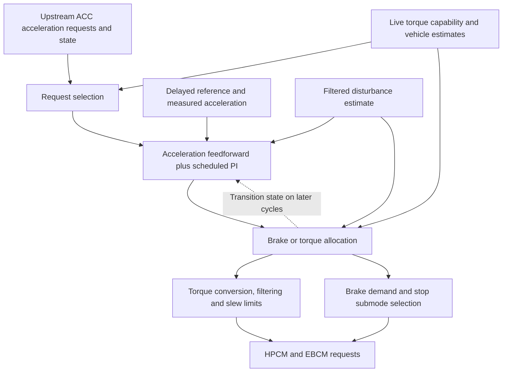

# ASCM longitudinal control review — 2026-09-17

This is a firmware/code comparison, not a claim that any proposed change has been
validated on the vehicle. No controller or maneuver settings were changed during
this review. The new sweep measures the existing brake submode; it does not by
itself compare ordinary braking with near-stop operation.

## Findings that change the tuning priorities

1. **Separate moving creep from stop handling.** Our speed-only selection of
   near-stop brake submode is broader than the OEM condition. Determine whether
   this accounts for pressure persisting or the vehicle completing a stop despite
   a small request before fitting a single brake-demand scale.
2. **Coordinate feedback with actuator allocation.** OEM feedback state, torque
   filtering, request selection, and mode changes interact. Our PI and allocator
   mostly operate independently. Preserve useful integral bias for hills, while
   tracking what the selected actuator path can actually produce.
3. **Use small-signal feedback scheduling if the measured plant is repeatable.**
   Stock has lower P at small errors, separate P/I reference filtering, and
   transition-specific feedback initialization. These are more targeted ideas
   than reducing every gain or copying all the OEM state logic.
4. **Investigate the signed brake request before assuming zero means full release.**
   The OEM path permits positive signed acceleration requests while brake mode is
   retained; ours clamps those to zero. EBCM behavior and actual OEM usage still
   need evidence. This is not an immediately usable tune change under current
   panda safety checks.

## Source and method

Read the existing decompilations under
`/home/acremins/volt_reverse_engineering/ASCM/decoded/ghidra_longitudinal/` and the
current sunnypilot controller, then ran targeted Ghidra decompilation using
`-readOnly -noanalysis` on the existing `gm_ascm` project. New exports and assembly
checks are in `/tmp/ascm_creep_review_20260917/` and
`/tmp/ascm_creep_review_detail/`. These temporary exports can be regenerated with
`ghidra_scripts/DecompileLong.java` using the function addresses below.

Calibration values below are big-endian integers read from
`decoded/23366550.bin`, file offset `0xa0 + calibration_offset`. The ACC block is
mixed integer/flag data; it must not be interpreted as an all-float array.

SHA-256:

- MPU1 OS `84876565.bin`: `28e7b4c9e7452c3a459843ff5a99ee12b156b86bab2dcd176f013bde4c84d544`
- ACC calibration `23366550.bin`: `de42f846cf8852e987af67f453ce98cf75835d63ffbdab677cbc9d847c497030`

Confidence: arithmetic and branch conditions are code-derived. Names such as
“disturbance” and “near-stop” describe inferred roles, not recovered OEM symbols.
Several state bits still lack a verified physical meaning. Presence of a path in
firmware does not establish how often stock ACC executes it during real creep.

## Structure of the OEM loop

`FUN_0012dce0` calls the input/state stage `FUN_00130cc0(40)` and main longitudinal
stage `FUN_00131440(40)`: the control arithmetic uses a 40 ms time step. Within the
latter, `FUN_00139d80` sequences:



| Stage | Function | Relevant behavior |
|---|---|---|
| Capability preparation | `00139ce0`, `001399a0` | Converts live minimum torque to equivalent acceleration; prepares other limits |
| Request selection | `0013ade0` | Uses upstream request alternatives, prior I correction, capability, and state; produces request states 0–4 |
| Acceleration feedback | `0013a5d0` | Undelayed feedforward, delayed references, P/I scheduling, transition resets/presets, disturbance correction |
| Allocation and submodes | `0013afc0` | Different entry/retention tables, request-state branches, hold and stop conditions |
| Torque output | `0013a360` | Physics conversion, minimum-torque seed on handoff, 150 ms calibration-based filter, rate limits |
| Auxiliary torque/hold logic | `0013a180` | Further state and transition handling; not simply the numeric friction request |
| Adaptation/monitoring | `0013b6c0`, `0013b910` | Parameter adaptation and response-history processing; low priority for initial creep work |

Our code already has acceleration feedforward plus PI, a delayed/filtered Volt
reference, the physics torque map, live AxleTorqueMin, mode hysteresis, slew
limits, and the one-frame minimum-torque seed on release. The missing strategy is
coordination among those stages, not the absence of a PI loop.

## 1. Near-stop submode is conditional, not just a speed threshold

At the end of `0013afc0`, submode 3 is selected through several state conditions.
Among them are speed below calibration `0x820`/`0x822` (both 1.5 m/s) combined with
bits in `DAT_4001dcc0` or `DAT_4001d9a0`, or expiry of `DAT_4001d91c`. Prior brake
mode also matters. Other branches choose submode 1, 2, 4, or 5 at low speed.
The physical meanings of all these flags are not yet resolved.

Our `gm/carcontroller.py` computes near_stop from `longActive`, `brake_mode`, and
`vEgo < 1.5`, without equivalent state conditions. Thus ordinary low-speed brake
operation is necessarily sent as submode 3 (CAN mode 0xB), unless standstill
selects 0xD. This is a confirmed structural difference; it does not prove that
0xB itself causes the observed extra braking.

**Implication:** after the present sweep, compare 0xA and 0xB under matched moving
conditions if the evidence warrants a dedicated follow-up. Keep deliberate stop
and hold behavior separate. In today's default sweep, starting at 3 mph is already
below 1.5 m/s, so its baseline is active 0xB even at zero numeric demand. The sweep
cannot establish what the same demand would do in 0xA.

## 2. Positive brake-path acceleration is preserved by stock arithmetic

In the normal retained-brake branches, `0013afc0` requests
`corrected_acceleration - disturbance_correction`, without a zero upper clamp.
`00131440` bounds this field up to +2.0 m/s². The MPU2 getter `00047cb0` encodes a
signed 12-bit value at 0.01 m/s²/count and also permits positive values.

Our allocator uses `min(accel, 0.)`, so a small positive corrected acceleration
while retaining brake mode becomes zero brake counts. Stock has numeric range
beyond that point. For example, with zero disturbance, a +0.05 m/s² request may
remain below the retained-mode threshold and reach the stock brake output as +5
signed counts. This is a reachable arithmetic example, not an observed stock trace.

**Unknown:** whether the EBCM uses such a request to progressively release pressure,
merely clamps it internally, or treats it differently in different submodes.
ASCM firmware cannot answer that. Capturing OEM 0x315 and 0x170 during creep/release
would be particularly useful.

Current `opendbc/safety/modes/gm.h` decodes the field as unsigned brake magnitude;
positive signed counts are interpreted as a large brake demand and rejected.
Example: +5 becomes `(4096 - 5) & 4095 = 4091`, above the 400-count limit. Therefore
this is a separate protocol/safety investigation, not a suggestion to enable it
by editing a gain or bypassing safety.

## 3. Disturbance compensation must be traced through both paths

`001344b0` forms `DAT_4001d8f4` from a filtered difference between the acceleration
input from `000c32d0` and the vehicle acceleration from `000c0d50`. Calibration
`0x6a4 = 2000` gives a nominal 2 s filter through the time-step-normalized helper.
The first input comes through an MPU2-associated internal block at `40008b28`;
its precise physical definition and sign relative to road grade remain unresolved.
This is not AxleTorqueMin and must not be replaced by it.

Table `0x774` scales that estimate approximately by 0.733, saturating at ±2.2 m/s².
Call its result d. In the ordinary feedback branch, ignoring dormant D and second
I terms and exceptional transition overrides:

```
w = acceleration_feedforward + P + I
corrected_request = w + d
torque_request = physics_feedforward(w + d)
brake_acceleration = corrected_request - d = w
```

The mode threshold also includes d: the prior-brake table uses `0.4*d`
(`0x78c = 600`); the other table uses `0.2*d` (`0x78e = 800`). Thus omitting d from
both command branches does not make the full selector/torque behavior equivalent.
Simply adding d as an extra brake offset would be inconsistent with this stock
path and could double-count compensation already handled downstream.

**Implication:** retain a slow integral correction for uphill/downhill residuals.
If we later add a grade/disturbance estimate, explicitly define whether each
signal represents desired vehicle acceleration or actuator effort. Apply it
consistently to torque conversion, allocation thresholds, and brake conversion.

## 4. Stock has softer, separately shaped small-signal feedback

The confirmed P schedule input is **abs(feedforward) + 2*abs(delayed error)**.
The earlier ASCM notes reversed those weights. Table `0x74e` is Kp = 0.02 at
0.3 m/s² and 0.20 at 2.5 m/s², linearly interpolated and clamped at the endpoints.

For zero feedforward and a 0.1 m/s² error, the raw stock P contribution is
0.002 m/s²; ours is 0.010 m/s² with fixed Kp = 0.1. Stock then filters P further.
This fivefold difference applies to that small-signal example, not every state.

The P error uses a delayed reference; the I error uses that delayed reference
with additional filtering. All four ordinary delay calibrations `0x82a..0x830`
are 120 ms, but other states can alter delay. `0x79c = 100` is used with integer
`100 / 40 = 2` in the I-reference filter. Our Volt uses a fixed 120 ms delay and
100 ms floating-point filter for both P and I.

Low-speed stock Ki is 0.225/s; ours is 0.3/s. At constant 0.1 m/s² error these
produce 0.0225 versus 0.030 m/s² correction per second, before gates/limits.
Stock's slope/state-dependent halving is conditional, not always active.

**Correction to earlier filter notes:** the P-filter table `0x756` returns raw
weights 1000, 300, 200 at elapsed-time coordinates 500, 1000, 2000 ms. Assembly at
`0013ab16..0013ab56` confirms these weights go directly to `0012e5e0`, without
conversion by the time step. The helper computes `(old*n + input)/(n+1)` with
integer truncation and forces a one-unit step if it would otherwise stick.
Therefore these are not verified 1.0/0.3/0.2-second time constants. A floating-point
port with those supposed time constants would not reproduce the OEM filter.
At the 0.001 m/s² internal resolution, the forced step materially affects tiny
P corrections. Prefer measuring the desired response and implementing a simple
explicit filter rather than copying these integers blindly.

## 5. Feedback state is coordinated with actuator changes

`0013a5d0` detects mode transitions and other state events, resets its reference
filter toward measured acceleration, and clears or presets I in different
branches. Brake PI is enabled in this calibration (`0x6ba = 1`); the firmware's
optional brake-PI-disable branch is not active. The integrator can therefore
continue correcting brake demand, consistent with the desired hill behavior.

Stock gates I for several error/output/state conditions. Its max-torque-related
condition uses `0x72d = 250`, i.e. a threshold of 3.5 times the reported max torque;
it is not tight anti-windup at the actual torque limit. Do not copy that literal
condition and claim actuator saturation has been solved.

Our generic PID checks acceleration limits. It does not know that the downstream
allocator has clipped positive brake requests, applied a 0.8 creep scale, hit the
speed-dependent brake floor, or rate-limited torque. The minimum-torque handoff
seed already exists in our allocator, but no matching mode information is fed
back to the PI. Stock also filters torque (`0x72e = 150`) after the handoff; ours
currently only slews it.

**Candidate architecture:** preserve one integral bias representing required effort,
report selected mode and effective bounds from the allocator, and track/back-calculate
I only where actuator saturation or a handoff makes the old state inconsistent.
Do not freeze I throughout creep: it must still release brake uphill and increase
brake downhill. This is an engineering recommendation inspired by stock's state
coordination, not a claim that stock implements textbook back-calculation.

## What to do with the new sweep logs

1. Inspect the two-second **active-mode zero-demand baseline** first. Determine
   whether pressure or substantial deceleration is already present before the
   ramp. Distinguish a mode-entry transient from demand response.
2. Align transmitted counts, submode, pressure, actual torque, and speed/acceleration.
   Constant requested -650 Nm does not mean constant delivered axle torque. Keep
   AxleTorqueMin as capability/context, not a direct pressure or grade measurement.
3. Identify repeatable pressure/deceleration changes and lag; then select fixed
   holds around them. These moving ramps do not establish equilibrium speed.
4. If behavior suggests stop-mode intervention, prioritize the matched submode
   comparison before more blanket brake scaling. A release/downward ramp would
   additionally distinguish apply/release hysteresis from an input deadband.
5. Only after establishing a repeatable command response, evaluate modest P
   scheduling/filtering and coordinated integrator transitions independently.

The current sweep bounds end at roughly 0.9 mph, so this drive does **not** validate
holding 0.2 mph. It provides the command-response evidence needed before designing
that next experiment. Stock ACC's good stopping behavior likewise does not prove
that its controller can regulate an arbitrary 0.2 mph crawl unchanged.
