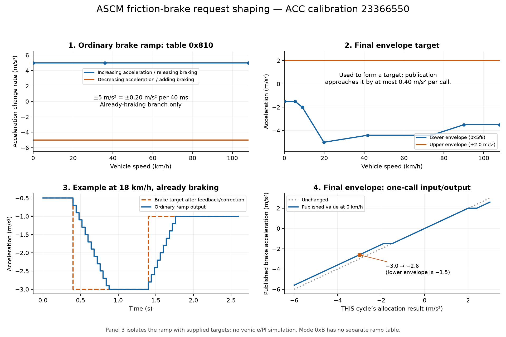
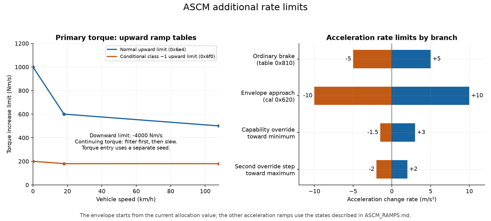
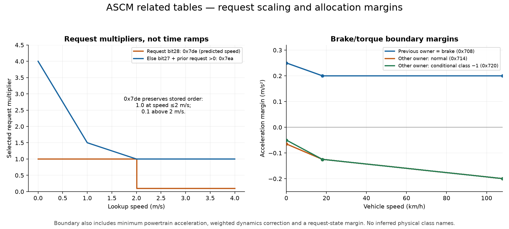

# How acceleration requests pass through the ASCM ramp limits

These plots use ACC calibration **23366550**, checked against the saved firmware
hash and table bytes. Arithmetic comes from MPU1 **84876565**. The time example
isolates one ramp; it is not a simulated stock drive or EBCM pressure response.



The acceleration request supplies a **target**. Vehicle speed indexes most of
these tables. The difference between target and current command determines the
requested rate of change; the selected rate limits bound that change. The
request does not move or modify the calibration table itself.

For example, with an ordinary brake target of −3.0 m/s² and previous published
brake demand of −0.5 m/s², the next allocation result is −0.7 m/s² at 40 ms.
The ±5 m/s³ table allows a change of ±0.20 m/s² per cycle. Continuing this
branch gives −0.9, −1.1, … until the target is reached. More negative means
more requested deceleration. A less-negative target uses the positive rate.
This example assumes the ordinary brake branch remains selected and that final
envelope shaping does not change these values, as in panel 3 at 18 km/h.

## Pseudocode: the common slew operation

The equations below use SI units for readability. The Python reference preserves
raw integer division toward zero; these SI equations omit that quantization.

```python
def slew(target, start, minimum_rate, maximum_rate, dt_seconds):
    desired_rate = (target - start) / dt_seconds
    allowed_rate = clamp(desired_rate, minimum_rate, maximum_rate)
    return start + allowed_rate * dt_seconds
```

The starting value matters. For ordinary braking it is the previous published
brake demand. For final envelope shaping it is THIS cycle's allocation result.

## Pseudocode: request, feedback, then brake allocation

`selected` below is the result of the upstream candidate/request-state selection,
not necessarily the planner's untouched input. `P` and `I` come from delayed
acceleration-error feedback. `D` is the mapped sensor/vehicle dynamics correction.
The reference-rate and auxiliary-integral terms are zero from initialization
in this calibration. Table results here are converted to the stated SI units.

```python
# 13a5d0: choose corrected acceleration.
if request_bit25:                          # capability-ramp override
    corrected = slew(minimum_powertrain_accel, previous_corrected,
                     -1.5, +3.0, dt)
    if request_bit23:
        corrected = slew(maximum_powertrain_accel, corrected,
                         -2.0, +2.0, dt)   # SECOND step from the result above
        # A separate flag records completion or vehicle-bit26 termination.
    else:
        if ((previous_owner == TORQUE and corrected <= minimum_powertrain_accel)
            or (previous_owner == BRAKE and corrected >= minimum_powertrain_accel)):
            corrected = minimum_powertrain_accel
else:
    corrected = selected + P + I
    if request_enabled:
        corrected += D

# 13afc0: boundary for ordinary request states 1 and 2.
if previous_owner == BRAKE:
    margin = lookup(0x708, vehicle_speed)
    dynamics_weight = 0.4
else:
    table = 0x720 if dynamics_class == -1 and raw_d990 == 1 else 0x714
    margin = lookup(table, vehicle_speed)
    dynamics_weight = 0.2
boundary = minimum_powertrain_accel + margin + dynamics_weight * D
if request_state == 2:
    boundary += 0.050

# This block covers request states 1/2 only.
evaluate_boundary = not request_bit24 or request_bit23 or standstill_status
if not evaluate_boundary:
    owner, torque_accel, brake_accel = TORQUE, corrected, 0
elif corrected < boundary:
    owner, torque_accel = BRAKE, 0
    allocation_latch = True
    brake_target = corrected - D
    if previous_owner == BRAKE:
        rate = lookup(0x810, vehicle_speed)  # 5.0 m/s³ at every speed here
        brake_accel = slew(brake_target, previous_published_brake, -rate, +rate, dt)
    else:
        brake_accel = brake_target          # entry preset/ramp disabled in this calibration
elif not standstill_status and special_timer != 0:
    if not previous_hold and previous_brake_submode != 3:
        owner, brake_accel = TORQUE, 0
        torque_accel = minimum_powertrain_accel if allocation_latch else corrected
    else:
        owner = previous_owner             # keep previous numeric outputs too
        torque_accel = previous_torque_accel
        brake_accel = previous_published_brake
else:
    owner = BRAKE
    brake_accel = corrected                 # no subtraction of D, no 0x810 slew
    torque_accel = previous_torque_accel    # firmware leaves this slot untouched
```

Request states 0, 3 and 4 take separate branches; this pseudocode does not silently
apply the ordinary ramp to them. In particular, state 3's brake path directly
assigns `corrected - D`; state 4 forces torque. See
[`allocate_acceleration`](ascm_loop_reference.py) for all branches. Brake submode
3 (`0xB` when active) is **not** the same variable as request state 3.

The ordinary sum includes `D`, then ordinary brake allocation subtracts it.
That cancellation does not remove its influence on the selection boundary or
make the exceptional branches equivalent to the ordinary branch.

## Pseudocode: final brake envelope

```python
# 131440, after allocation, for the normal publication configuration.
lower = lookup(0x5f6, vehicle_speed)         # −1.5 at 0–1.5 m/s; see graph
upper = +2.0
bounded_target = clamp(brake_accel, lower, upper)
published_brake = slew(bounded_target, brake_accel, -10.0, +10.0, dt)
previous_published_brake = published_brake   # stored back for the next cycle

# Submode selection and brake-active are computed separately.
publish_acceleration_and_mode(published_brake, brake_active, brake_submode)
```

This is **not a hard output clamp**. At zero speed, allocation −3.0 yields target
−1.5, but the 40 ms publication step returns **−2.6 m/s²**. If another branch
writes −3.0 into allocation again every cycle, publication again returns −2.6;
it does not independently accumulate progress toward −1.5. If the ordinary
ramp is active, its use of the previous published output can produce a different
sequence. Do not simulate the envelope in isolation with an invented history.

There is no separate ramp table selected by `0xB`, `0xC` or `0xD` in these stages.
Their selection uses other conditions. Previous submode 3 blocks the ordinary
release branch above, which can retain demand rather than ramp it. The EBCM's
physical response to each mode is not established by the ASCM code.

## Primary torque and other acceleration rates



For continuing torque ownership, `13a360` converts torque-path acceleration with
the vehicle model, applies sign-dependent efficiency, filters, then slews:

```python
if dynamics_class == +1:
    model.rolling_term += lookup(0x7fa, speed)  # AFTER capability calculations

converted_torque = acceleration_to_torque(torque_accel, model, speed)
target_torque = apply_sign_dependent_efficiency(converted_torque)

if owner != TORQUE:
    torque_command = -650                   # Nm; separate enable still matters
elif previous_owner != TORQUE:
    torque_command = capability_adjusted_minimum_torque
    torque_filter_state = torque_command
else:
    weight = floor(150 / dt_ms)             # 3 at 40 ms
    filtered = integer_filter(target_torque, torque_filter_state, weight)
    alternate = (dynamics_class == -1 and
                 (raw_d990 == 2 or (raw_d990 == 1 and selected < 0.5)))
    upward_limit = lookup(0x6f0 if alternate else 0x6e4, speed)
    torque_command = slew(filtered, previous_torque_command,
                          -4000, upward_limit, dt)
    torque_filter_state = filtered
```

Normal upward limits are 1000/600/500 Nm/s at 0/5/30 m/s. The alternate table
is 200/180/180 Nm/s. Acceleration changes the model-derived torque target; speed
indexes the rate table, and class/state/request conditions choose which table.
These Nm/s limits cannot be treated as the friction-brake m/s³ limits.

The separate auxiliary torque number has ±10000 Nm/s shaping in its applicable
branches. No actuator publisher for that numeric field was found; its routine
also changes hold and flags. It is not included as another actuator-command plot.

## Other tables that can look like ramps



`0x7de` and `0x7ea` multiply the selected acceleration request; they are not
per-second slew limits. Request bit28 selects `0x7de` using predicted speed.
Otherwise, bit27 with a positive previous selected request selects `0x7ea`
using current speed. Other cases use a multiplier of 1.

Preserve `0x7de`'s descending stored point order. The recovered lookup actually
returns **1.0 at speed ≤2 m/s and 0.1 above 2 m/s**. Sorting those points to draw
a smooth interpolation would graph a different algorithm. `0x7ea` multiplies
by 4.0/1.5/1.0 at 0/1/2 m/s. These branches can also change request state; see
`select_request()` for the timer and flag conditions.

The `0x708/714/720` margins shift the brake/torque decision boundary. They change
which path runs; they do not specify how quickly its command moves.

## Artifacts and reproduction

- [Friction-brake SVG](ascm_ramp_reference/friction_brake_ramps.svg)
- [Other-ramp SVG](ascm_ramp_reference/other_ramps.svg)
- [Request/allocation SVG](ascm_ramp_reference/request_and_allocation_tables.svg)
- [Stored table points, with SI units](ascm_ramp_reference/table_points.csv)
- [Illustrative brake step data](ascm_ramp_reference/brake_step_example.csv)
- [Calibration identity and scalar values](ascm_ramp_reference/provenance.json)

Run `python3 openpilot/tools/longitudinal_maneuvers/plot_ascm_ramps.py` in an
environment with matplotlib. Use `--calibration PATH` or `ASCM_FIRMWARE_ROOT`
for a different local firmware location. The script uses `stock_lookup` and
`stock_integer_slew` from the explanatory reference, checks calibration/table
identity, and writes PNG, SVG and CSV artifacts without vehicle communication.
